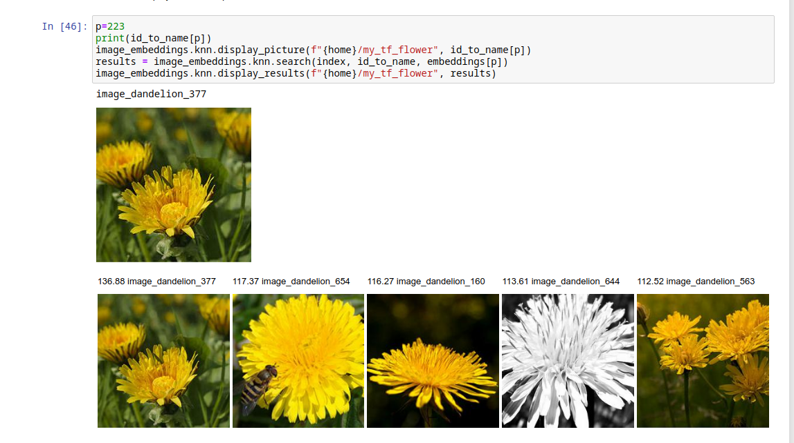

# image_embeddings
[](https://pypi.python.org/pypi/image_embeddings)
[](https://github.com/rom1504/image_embeddings/actions?query=workflow%3A%22Continuous+integration%22)


Using efficientnet to provide embeddings for retrieval.

Why this repo ? Embeddings are a widely used technique that is well known in scientific circles. But it seems to be underused and not very well known for most engineers. I want to show how easy it is to represent things as embeddings, and how many application this unlocks.



## Workflow
1. download some pictures
2. run inference on them to get embeddings
3. simple knn example, to understand what's the point : click on some pictures and see KNN

## Simple Install

Run `pip install image_embeddings`

## Example workflow

1. run `image_embeddings save_examples_to_folder --images_count=1000 --output_folder=tf_flower_images`, this will retrieve 1000 image files from https://www.tensorflow.org/datasets/catalog/tf_flowers (but you can also pick any other dataset)
2. produce tf records with `image_embeddings write_tfrecord --image_folder=tf_flower_images --output_folder=tf_flower_tf_records --shards=10`
3. run the inference with `image_embeddings run_inference --tfrecords_folder=tf_flower_tf_records --output_folder=tf_flower_embeddings`
4. run a random knn search on them `image_embeddings random_search --path=tf_flower_embeddings`

Optionally if you want to use the embeddings in numpy (in other languages), run `image_embeddings embeddings_to_numpy --input_path=tf_flower_embeddings --output_path=tf_flower_numpy`

```
$ image_embeddings random_search --path=tf_flower_embeddings
image_roses_261
160.83 image_roses_261
114.36 image_roses_118
102.77 image_roses_537
92.95 image_roses_659
88.49 image_roses_197
```

Explore the [Simple notebook](notebooks/using_the_lib.ipynb) for more details.

You can try it locally or [try it in colab](https://colab.research.google.com/github/rom1504/image_embeddings/blob/master/notebooks/using_the_lib.ipynb)

The [From scratch](notebooks/from_scratch.ipynb) notebook provides an explanation on how to build this from scratch.

## API

### image_embeddings.downloader

Downloader from tensorflow datasets. Any other set of images could be used instead

#### image_embeddings.downloader.save_examples_to_folder(output_folder, images_count=1000, dataset="tf_flowers")

Save https://www.tensorflow.org/datasets/catalog/tf_flowers to folder
Also works with other tf datasets

### image_embeddings.inference

Create tf recors from images files, and apply inference with an efficientnet model. Other models could be used.

#### image_embeddings.inference.write_tfrecord(image_folder, output_folder, num_shards=100)

Write tf records from an image folders

#### image_embeddings.inference.run_inference(tfrecords_folder, output_folder, batch_size=1000)

Run inference on provided tf records and save to folder the embeddings

### image_embeddings.knn

Convenience methods to read, build indices and apply search on them. These methods are provided as example.
Use [faiss](https://github.com/facebookresearch/faiss) directly for bigger datasets.

#### image_embeddings.knn.read_embeddings(path)

Run embeddings from path and return a tuple with 
* embeddings as a numpy matrix
* an id to name dictionary
* a name to id dictionary

#### image_embeddings.knn.build_index(emb)

Build a simple faiss inner product index using the provided matrix of embeddings

#### image_embeddings.knn.search(index, id_to_name, emb, k=5)

Search the query embeddings and return an array of (distance, name) images

#### image_embeddings.knn.display_picture(image_path, image_name)

Display one picture from the given path and image name in jupyter

#### image_embeddings.knn.display_results(image_path, results)

Display the results from search method

#### image_embeddings.knn.random_search(path)

Load the embeddings, apply a random search on them and display the result

#### image_embeddings.knn.embeddings_to_numpy(input_path, output_folder)

Load the embeddings from the input folder as parquet and save them as
* json for the id -> name mapping
* numpy for the embeddings

Particularly useful to read the embeddings from other languages

## Advanced Installation

### Prerequisites

Make sure you use `python>=3.6` and an up-to-date version of `pip` and
`setuptools`

    python --version
    pip install -U pip setuptools

It is recommended to install `image_embeddings` in a new virtual environment. For
example

    python3 -m venv image_embeddings_env
    source image_embeddings_env/bin/activate
    pip install -U pip setuptools
    pip install image_embeddings

### Using Pip

    pip install image_embeddings

### From Source

First, clone the `image_embeddings` repo on your local machine with

    git clone https://github.com/rom1504/image_embeddings.git
    cd image_embeddings
    make install

To install development tools and test requirements, run

    make install-dev

## Test

To run unit tests in your current environment, run

    make test

To run lint + unit tests in a fresh virtual environment,
run

    make venv-lint-test

## Lint

To run `black --check`:

    make lint

To auto-format the code using `black`

    make black

## Tasks

* [x] simple downloader in python
* [x] simple inference in python using https://github.com/qubvel/efficientnet
* [x] build python basic knn example using https://github.com/facebookresearch/faiss
* [ ] build basic ui using lit element and some brute force knn to show what it does, put in github pages
* [ ] use to illustrate embeddings blogpost
